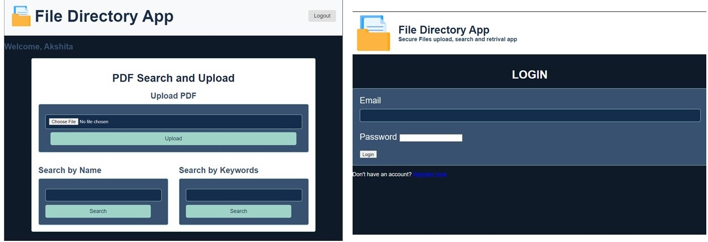

# PDF File Management Web Application

## Overview

This project is a web application designed to manage, search, and retrieve PDF files stored in a centralized database. It addresses common inefficiencies and security issues in traditional file storage systems by centralizing file storage and improving search capabilities.

The application is built using Python with the Flask framework for the backend, and HTML, CSS, and JavaScript for the frontend. It supports secure user authentication, file upload, and search features, allowing users to efficiently manage their digital documents.

## Key Features

- **Secure User Authentication**: Register, login, and logout functionalities to ensure that only authenticated users can access the application.
- **File Upload**: Upload PDF files to a central database.
- **Search by Name**: Locate files by their name.
- **Search by Keywords**: Find files by searching for keywords within the document content using OCR technology.
- **File Retrieval**: Open and download files directly from the application.

## Technologies Used

- **Backend**: Flask, Python
- **Frontend**: HTML, CSS, JavaScript
- **Database**: MySQL
- **OCR**: pytesseract for text extraction from PDF images
- **File Handling**: PyMuPDF (fitz), PIL (Pillow)

## Configuration

- **Tesseract OCR**: Ensure Tesseract-OCR is installed and configured. Update the path to the Tesseract executable in the `app.py` file if necessary.
- **Session Timeout**: The session timeout is set to 5 minutes of inactivity. Adjust this by modifying the `PERMANENT_SESSION_LIFETIME` setting in the `app.config`.

## Usage

- **Registration**: Users need to register with a username, email, and password.
- **Login**: Registered users can log in to access the file management features.
- **Upload**: Users can upload PDF files, which will be stored in the database.
- **Search**: Users can search for files by name or by keywords within the PDF documents.
- **File Operations**: Users can open or download files directly from the application.
